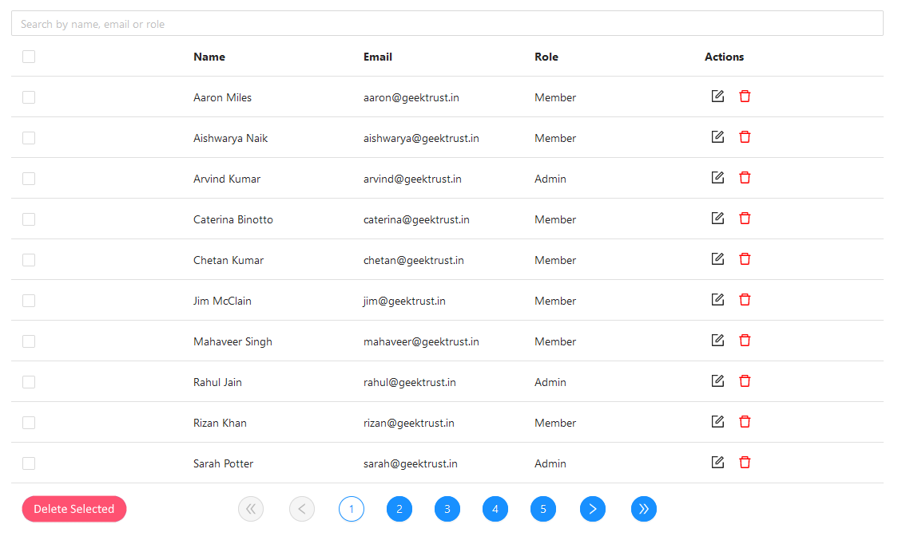

# [Admin UI](https://www.geektrust.com/coding/detailed/admin-ui)

## Problem Statement

You work at a startup that is building an interface for admins to see and delete
users. The users will be provided via an API. Your job is to build out a working
UI. See image below for reference.

Note - this is for reference only. You don't need to build the exact same UI.



## Local Setup

```bash
> pnpm install
> pnpm run dev
```

Then you can open the application in your browser at `http://localhost:5173/`.
You can use anything other package manager like npm or yarn.

## Requirements

1. Column titles must stand out from the entries.
2. There should be a search bar that can filter on any property.
3. You should be able to edit or delete rows in place.(There is no expectation
   of persistence. Edit and delete are expected to only happen in memory.)
4. You need to implement pagination: Each page contains 10 rows. Buttons at the
   bottom allow you to jump to any page including special buttons for first
   page, previous page, next page and last page. Pagination must update based on
   search/filtering. If there are 25 records for example that match a search
   query, then pagination buttons should only go till 3.
5. You should be able to select one or more rows. A selected row is highlighted
   with a grayish background color. Multiple selected rows can be deleted at
   once using the 'Delete Selected' button at the bottom left.
6. Checkbox on the top left is a shortcut to select or deselect all displayed
   rows. This should only apply to the ten rows displayed in the current page,
   and not all 50 rows.

## Instructions to Pass Automated Correctness Check

1. Search box placeholder text should start with Search.
2. Search icon/button should have class as search-icon OR trigger search on
   ENTER.
3. Action element must be a button with a specific class name like edit, delete,
   save.
4. Navigation elements must be a div/button, and should have class name as
   first-page, previous-page, next-page and last-page and page numbers should be
   mentioned accordingly.
5. On clicking edit action in a row, it should be editable in the row itself.
6. Bottom delete button must have text Delete Selected.
7. Avoid using libraries like material UI and bootstrap for basic html
   components like buttons, checkboxes, textbox etc.
8. We execute your application and run it on a specific port. This helps us in
   running automated tests against the UI you have developed. Hence please do
   not force the application to run on any specific ports in your
   configuration/package manager file. Please ensure that you are not overriding
   the PORT environment variable in your configuration/package manager file.
9. On executing, your application should be running successfully on
   http://<hostname>:<port>. For e.g if the hostname of your local system is
   dev.local and the port you are running is 3030, then your application should
   be accessible at http://dev.local:3030/ and not just
   at http://localhost:3030/ .

## Users API

We provide you an Users API to list all the users and their properties.

**Note :**
The users are sorted by `id` field. There is no alphabetical sorting.

**Request Type :**
`GET`

**Endpoint :**
https://geektrust.s3-ap-southeast-1.amazonaws.com/adminui-problem/members.json
**Sample Response :**

```json
[
  {
    "id": "1",
    "name": "Aaron Miles",
    "email": "aaron@mailinator.com",
    "role": "member"
  },
  {
    "id": "2",
    "name": "Aishwarya Naik",
    "email": "aishwarya@mailinator.com",
    "role": "member"
  },
  {
    "id": "3",
    "name": "Arvind Kumar",
    "email": "arvind@mailinator.com",
    "role": "admin"
  }
]
```
